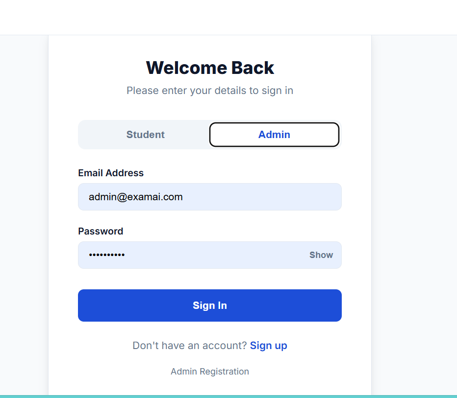
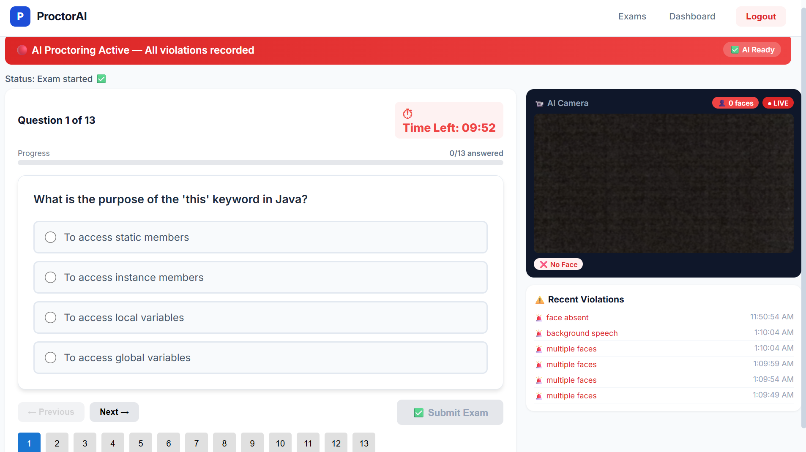
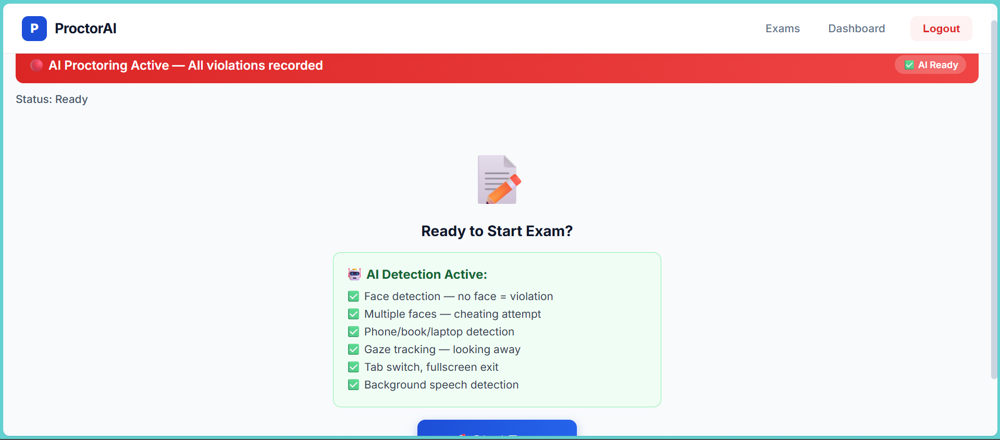
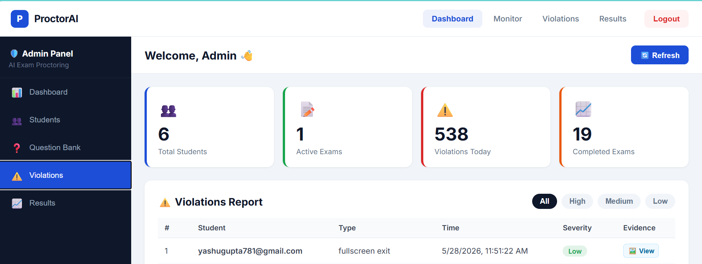
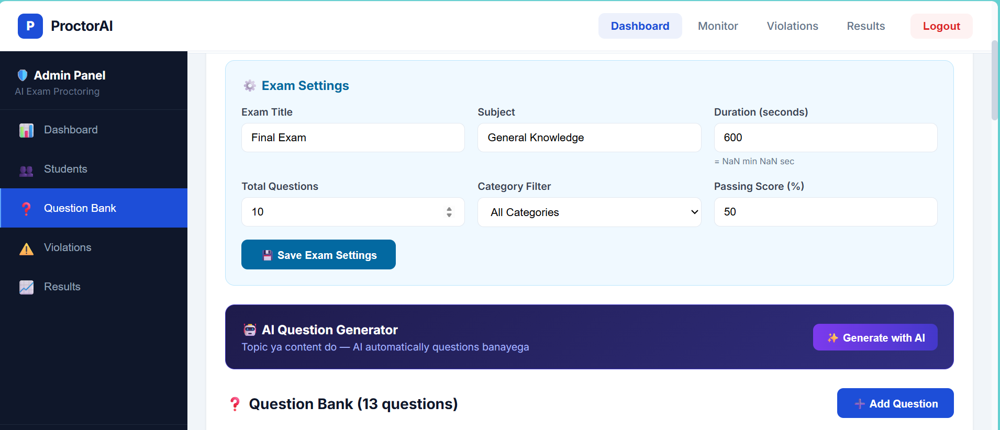

# PROJECT REPORT

# AI ONLINE EXAM PROCTORING SYSTEM

---

# Submitted By

**Name:** Yashu Gupta(EN23CS3011161)

NAME: Yashvardhan Hiranandani(EN23CS3011163)

 **Name:** Yuvraj Yadav(EN23CS3011172)  


**Course:** Bachelor of computer science
**Academic Session:** 2025-2026

---

# ABSTRACT

The AI Online Exam Proctoring System is a web-based application designed to conduct secure online examinations with AI-powered monitoring features. The system uses webcam monitoring, face verification, liveness detection, and suspicious activity analysis to minimize cheating during online exams.

The project provides real-time monitoring of candidates and automatically detects activities such as tab switching, multiple face detection, absence from camera, and suspicious behavior. The system improves examination transparency and reduces manual proctoring efforts using Artificial Intelligence and Computer Vision technologies.

---

# INTRODUCTION

Online examinations have become increasingly popular due to advancements in digital technologies and remote learning systems. However, maintaining exam integrity and preventing cheating remain major challenges.

The AI Online Exam Proctoring System addresses these challenges by providing an intelligent online examination environment with automated monitoring and AI-based violation detection.

The system combines web technologies and computer vision techniques to create a secure and efficient examination platform.

---

# OBJECTIVES OF THE PROJECT

* To conduct secure online examinations
* To detect suspicious activities during exams
* To monitor students using webcam surveillance
* To automate online exam proctoring
* To reduce cheating using AI technologies
* To provide real-time violation detection

---

# PROBLEM STATEMENT

Traditional online examination systems lack proper monitoring mechanisms, making cheating and unfair practices easier during remote examinations. Manual invigilation is difficult and inefficient for large-scale online exams.

This project aims to solve these problems by implementing AI-based automated proctoring features that monitor student activities continuously during the examination.

---

# TECHNOLOGY STACK

## Frontend Technologies

* React.js
* Vite
* JavaScript
* CSS

## Backend Technologies

* Node.js
* Express.js

## Database

* MongoDB

## AI and Computer Vision

* Python
* OpenCV
* Face Recognition

## Other Tools

* Socket.IO
* Axios
* Git & GitHub
* Visual Studio Code

---

# SYSTEM MODULES

## 1. Authentication Module

This module handles:

* Student registration
* Student login
* Admin login

 

## 2. Examination Module

This module provides:

* Online exam interface
* Question management
* Timer-based exams
* Answer submission
 
 


## 3. AI Proctoring Module

This module performs:

* Webcam monitoring
* Face verification
* Liveness detection
* Suspicious activity detection
 
 


## 4. Violation Detection Module

This module detects:

* Tab switching
* Multiple faces
* Absence from webcam
* Suspicious movements

 
 
 

## 5. Admin Dashboard

The admin can:

* Monitor students
* View violations
* Manage exams
* Access reports
 

 

# FEATURES OF THE SYSTEM

* Student Authentication
* Online Examination
* Real-time Monitoring
* Webcam Surveillance
* Face Verification
* Liveness Detection
* AI-based Cheating Detection
* Violation Reporting
* Admin Dashboard
* Exam Timer
* Secure Exam Environment

---

# WORKING OF THE SYSTEM

1. Student logs into the system.
2. Face verification is performed before exam start.
3. Webcam monitoring starts automatically.
4. Student attends the online examination.
5. AI continuously monitors suspicious activities.
6. Violations are recorded in real-time.
7. Admin can monitor all activities through dashboard.

---

# PROJECT STRUCTURE

```bash
ai-online-exam-proctoring-system/
│
├── frontend/
├── backend/
├── ai-module/
├── ai-detection/
├── uploads/
├── README.md
└── start-all.bat
```

---

# INSTALLATION AND EXECUTION

## Step 1: Clone Repository

```bash
git clone repository_link
```

## Step 2: Install Frontend Dependencies

```bash
cd frontend
npm install
```

## Step 3: Run Frontend

```bash
npm run dev
```

## Step 4: Install Backend Dependencies

```bash
cd backend
npm install
```

## Step 5: Run Backend

```bash
npm run dev
```

---

# OUTPUT SCREENS

## Login Page

(Add Screenshot)

## Student Dashboard

(Add Screenshot)

## Admin Dashboard

(Add Screenshot)

## Violation Detection Screen

(Add Screenshot)

---

# ADVANTAGES OF THE SYSTEM

* Automated exam monitoring
* Reduced cheating possibilities
* Real-time violation detection
* Secure online examination environment
* Reduced manual invigilation
* Efficient remote examination process

---

# LIMITATIONS

* Requires webcam access
* Internet connectivity is necessary
* Performance depends on camera quality
* AI accuracy may vary under poor lighting conditions

---

# FUTURE ENHANCEMENTS

* Eye movement tracking
* Audio monitoring
* Mobile application support
* Advanced AI behavior analysis
* Cloud deployment
* Facial emotion detection

---

# TESTING SUMMARY

* Passed Tests: 58
* Failed Tests: 2
* Warning Tests: 4
* Overall Health Score: 91%

---

# CONCLUSION

The AI Online Exam Proctoring System successfully provides a secure and intelligent platform for conducting online examinations. The integration of AI technologies and computer vision improves examination integrity and minimizes unfair practices during remote exams.

This project demonstrates the practical implementation of modern web technologies combined with Artificial Intelligence for educational applications.

---

# REFERENCES

1. React.js Official Documentation
2. Node.js Official Documentation
3. OpenCV Documentation
4. MongoDB Documentation
5. Express.js Documentation
6. GitHub Resources and Tutorials

---
